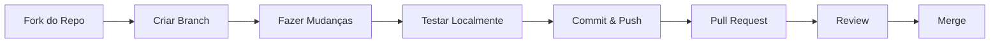
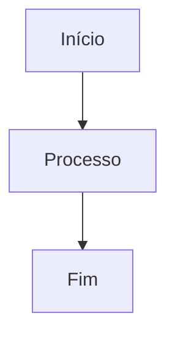

# 🤝 Guia de Contribuição

> **Versão:** 1.0 | **Última atualização:** 23 de Outubro de 2025

Este guia explica como contribuir com a documentação do Dashboard Sabrina Costa, incluindo padrões de escrita, processo de revisão e ferramentas necessárias.

---

## 🎯 **Como Contribuir**

### 1. **Tipos de Contribuição**

- 📝 **Correções** - Typos, links quebrados, informações incorretas
- 📚 **Melhorias** - Exemplos mais claros, explicações detalhadas
- 🆕 **Novo conteúdo** - Novos guias, tutoriais, referências
- 🔧 **Ferramentas** - Scripts, automações, melhorias técnicas

### 2. **Processo de Contribuição**



---

## 📝 **Padrões de Escrita**

### 1. **Estrutura de Documentos**

```markdown
# Título Principal

> **Tempo estimado:** X minutos  
> **Pré-requisitos:** [Link para pré-requisito]

Breve descrição do que o documento aborda.

---

## 🎯 **O que você vai aprender**

✅ Objetivo 1  
✅ Objetivo 2  
✅ Objetivo 3  

---

## 🔧 **Seção Principal**

Conteúdo detalhado com exemplos práticos.

### Subseção

Mais detalhes específicos.

---

## ✅ **Checklist Final**

- [ ] Item 1
- [ ] Item 2
- [ ] Item 3

---

## 🎯 **Próximos Passos**

1. [Próximo guia](link)
2. [Guia relacionado](link)

---

## 📞 **Suporte**

- 🐛 **Bugs:** [GitHub Issues](link)
- 💬 **Discussões:** [GitHub Discussions](link)
- 📧 **Email:** ops@macspark.dev
```

### 2. **Formatação**

**Títulos:**
```markdown
# Título Principal (H1)
## Seção Principal (H2)
### Subseção (H3)
#### Detalhe (H4)
```

**Ênfase:**
```markdown
**Negrito** para conceitos importantes
*Itálico* para termos técnicos
`Código inline` para comandos
> Citações para notas importantes
```

**Listas:**
```markdown
- Item simples
- ✅ Item com check
- ❌ Item com X
- 🔧 Item com ícone
```

**Código:**
```markdown
```bash
# Comandos de terminal
curl -X POST /api/endpoint
```

```javascript
// Código JavaScript
const response = await fetch('/api/endpoint');
```

```sql
-- Queries SQL
SELECT * FROM metrics WHERE date = '2025-10-23';
```
```

### 3. **Ícones e Emojis**

**Categorias:**
- 🎯 **Objetivos** - O que será aprendido
- 🔧 **Configuração** - Setup e instalação
- 📊 **Dados** - Métricas e informações
- 🚀 **Deploy** - Publicação e produção
- 🧪 **Testes** - Verificação e validação
- 🆘 **Troubleshooting** - Resolução de problemas
- ✅ **Checklist** - Lista de verificação
- 🎯 **Próximos passos** - Continuidade
- 📞 **Suporte** - Contatos e ajuda

**Status:**
- ✅ **Sucesso** - Funcionando corretamente
- ❌ **Erro** - Problema identificado
- 🔄 **Processo** - Em andamento
- ⚠️ **Atenção** - Cuidado necessário
- 💡 **Dica** - Sugestão útil
- 🚨 **Crítico** - Problema grave

---

## 🔧 **Ferramentas Necessárias**

### 1. **Editor de Texto**

**Recomendado:** VS Code com extensões:
- Markdown All in One
- Markdown Preview Enhanced
- markdownlint
- Mermaid Preview

### 2. **Validação**

**Markdownlint:**
```bash
# Instalar
npm install -g markdownlint-cli

# Validar
markdownlint docs/**/*.md
```

**Link checker:**
```bash
# Instalar
npm install -g markdown-link-check

# Verificar links
markdown-link-check docs/**/*.md
```

### 3. **Preview**

**VS Code:**
- Ctrl+Shift+V (preview)
- Ctrl+K V (side-by-side)

**Online:**
- [Dillinger.io](https://dillinger.io)
- [StackEdit.io](https://stackedit.io)

---

## 📁 **Estrutura de Arquivos**

### 1. **Nomenclatura**

```bash
# Tutoriais
01-quickstart.md
02-primeiro-deploy.md
03-primeiro-workflow-n8n.md
04-conectar-whatsapp.md

# How-to Guides
setup-jwt.md
vercel-frontend.md
importar-workflows.md
configurar-alertas.md

# Reference
authentication.md
metrics.md
schedule.md
alerts.md

# Explanation
architecture.md
security.md
performance.md
data-flow.md
```

### 2. **Organização**

```
docs/
├── README.md                    # Índice principal
├── tutorials/                   # Passo a passo
├── how-to-guides/              # Guias específicos
│   ├── autenticacao/
│   ├── deploy/
│   ├── n8n/
│   └── api/
├── reference/                  # Documentação técnica
│   ├── api/
│   ├── database/
│   └── n8n/
├── explanation/                # Conceitos
├── meta/                       # Sobre documentação
└── historico/                  # Arquivos antigos
```

---

## 🧪 **Processo de Teste**

### 1. **Teste Local**

```bash
# 1. Fork e clone
git clone https://github.com/SEU_USERNAME/sabrina-costa.git
cd sabrina-costa

# 2. Criar branch
git checkout -b docs/melhorar-exemplo-api

# 3. Fazer mudanças
# Editar arquivos em docs/

# 4. Validar
markdownlint docs/**/*.md
markdown-link-check docs/**/*.md

# 5. Commit
git add docs/
git commit -m "docs: melhorar exemplos da API"
git push origin docs/melhorar-exemplo-api
```

### 2. **Checklist de Qualidade**

**Conteúdo:**
- [ ] Informação está correta e atualizada
- [ ] Exemplos funcionam e são testáveis
- [ ] Links internos e externos funcionam
- [ ] Imagens e diagramas estão corretos
- [ ] Formatação segue os padrões

**Estrutura:**
- [ ] Título claro e descritivo
- [ ] Tempo estimado realista
- [ ] Pré-requisitos listados
- [ ] Objetivos claros
- [ ] Checklist final
- [ ] Próximos passos
- [ ] Informações de suporte

**Técnico:**
- [ ] Markdown válido
- [ ] Links funcionando
- [ ] Código testado
- [ ] Comandos verificados
- [ ] Screenshots atualizados

---

## 🔄 **Processo de Review**

### 1. **Pull Request**

**Template:**
```markdown
## 📝 Descrição
Breve descrição das mudanças realizadas.

## 🔧 Tipo de Mudança
- [ ] Correção de bug
- [ ] Nova funcionalidade
- [ ] Melhoria na documentação
- [ ] Refatoração
- [ ] Outro (descrever)

## 📋 Checklist
- [ ] Código testado localmente
- [ ] Documentação atualizada
- [ ] Links verificados
- [ ] Exemplos testados
- [ ] Screenshots atualizados

## 🧪 Como Testar
Passos para testar as mudanças.

## 📸 Screenshots (se aplicável)
Adicionar screenshots das mudanças.
```

### 2. **Critérios de Aprovação**

**Conteúdo:**
- ✅ Informação precisa e atualizada
- ✅ Exemplos funcionais
- ✅ Linguagem clara e objetiva
- ✅ Estrutura consistente

**Técnico:**
- ✅ Markdown válido
- ✅ Links funcionando
- ✅ Código testado
- ✅ Comandos verificados

**Processo:**
- ✅ PR descritivo
- ✅ Checklist preenchido
- ✅ Testes realizados
- ✅ Screenshots (se necessário)

---

## 🎨 **Guia de Estilo**

### 1. **Tom e Linguagem**

**Características:**
- ✅ **Claro e direto** - Evitar jargões desnecessários
- ✅ **Acolhedor** - Usar "você" em vez de "o usuário"
- ✅ **Prático** - Focar em "como fazer" não "o que é"
- ✅ **Consistente** - Usar termos padronizados

**Exemplos:**
```markdown
❌ O usuário deve configurar as variáveis de ambiente
✅ Você precisa configurar as variáveis de ambiente

❌ A funcionalidade de autenticação JWT
✅ Como fazer login com JWT

❌ É necessário executar o comando
✅ Execute o comando
```

### 2. **Terminologia**

**Padrões:**
- **Dashboard** (não "painel")
- **Backend** (não "servidor")
- **Frontend** (não "interface")
- **Deploy** (não "publicação")
- **Workflow** (não "fluxo de trabalho")
- **Webhook** (não "gancho web")

**Tecnologias:**
- **n8n** (não "N8N" ou "n8n")
- **Vercel** (não "vercel")
- **PostgreSQL** (não "postgres")
- **WhatsApp** (não "whatsapp")

### 3. **Formatação de Código**

**Comandos:**
```bash
# Comentário explicativo
curl -X POST https://api.example.com/endpoint \
  -H "Content-Type: application/json" \
  -d '{"key": "value"}'
```

**Código JavaScript:**
```javascript
// Função com comentário
async function fetchData() {
  const response = await fetch('/api/endpoint');
  return response.json();
}
```

**SQL:**
```sql
-- Query com comentário
SELECT * FROM metrics 
WHERE date >= '2025-10-01'
ORDER BY date DESC;
```

---

## 🚀 **Automação**

### 1. **GitHub Actions**

**Workflow de validação:**
```yaml
name: Validate Docs

on:
  pull_request:
    paths:
      - 'docs/**'

jobs:
  validate:
    runs-on: ubuntu-latest
    steps:
      - uses: actions/checkout@v3
      - name: Setup Node.js
        uses: actions/setup-node@v3
        with:
          node-version: '18'
      - name: Install dependencies
        run: npm install -g markdownlint-cli markdown-link-check
      - name: Lint markdown
        run: markdownlint docs/**/*.md
      - name: Check links
        run: markdown-link-check docs/**/*.md
```

### 2. **Pre-commit Hooks**

```json
{
  "husky": {
    "hooks": {
      "pre-commit": "markdownlint docs/**/*.md"
    }
  }
}
```

---

## 📚 **Recursos Úteis**

### 1. **Documentação**

- [Markdown Guide](https://www.markdownguide.org/)
- [Mermaid.js](https://mermaid-js.github.io/mermaid/)
- [GitHub Flavored Markdown](https://github.github.com/gfm/)

### 2. **Ferramentas**

- [Dillinger.io](https://dillinger.io) - Editor online
- [StackEdit.io](https://stackedit.io) - Editor avançado
- [Mermaid Live Editor](https://mermaid.live/) - Diagramas
- [Markdown Tables](https://www.tablesgenerator.com/markdown_tables) - Tabelas

### 3. **Ícones e Emojis**

- [Emojipedia](https://emojipedia.org/) - Buscar emojis
- [GitHub Emoji](https://github.com/ikatyang/emoji-cheat-sheet) - Lista completa
- [Unicode Emoji](https://unicode.org/emoji/charts/full-emoji-list.html) - Referência oficial

---

## 🆘 **Dúvidas Frequentes**

### **Q: Como adicionar um novo tutorial?**
A: Crie um arquivo em `docs/tutorials/` seguindo a nomenclatura `XX-nome-do-tutorial.md` e atualize o `README.md` principal.

### **Q: Como criar diagramas?**
A: Use Mermaid.js com a sintaxe:
```markdown

```

### **Q: Como testar links?**
A: Use `markdown-link-check docs/**/*.md` ou configure no VS Code com a extensão "markdown-link-check".

### **Q: Como adicionar screenshots?**
A: Salve as imagens em `docs/assets/images/` e referencie com ``.

---

## 📞 **Suporte**

- 🐛 **Bugs:** [GitHub Issues](https://github.com/Marcocardoso91/sabrina-costa/issues)
- 💬 **Discussões:** [GitHub Discussions](https://github.com/Marcocardoso91/sabrina-costa/discussions)
- 📧 **Email:** ops@macspark.dev
- 📖 **Docs:** [Documentação Completa](../README.md)

---

**🤝 Obrigado por contribuir! Sua ajuda torna a documentação melhor para todos.**
