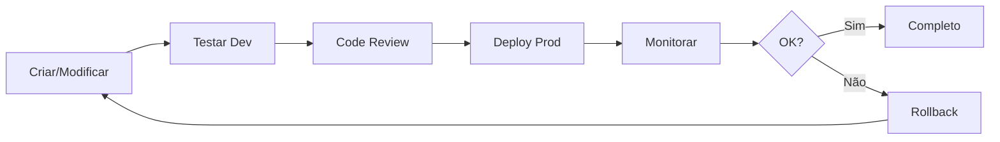

# 🚀 Deployment Guide - n8n Workflows

Guia completo para deploy de workflows do ambiente de desenvolvimento para produção.

## 📋 Índice

1. [Fluxo de Deploy](#fluxo-de-deploy)
2. [Ambientes](#ambientes)
3. [Pré-Deploy Checklist](#pré-deploy-checklist)
4. [Deploy Step-by-Step](#deploy-step-by-step)
5. [Rollback](#rollback)
6. [Troubleshooting](#troubleshooting)

---

## 1. Fluxo de Deploy

```
Development → Testing → Staging (opcional) → Production
```

### Workflow Lifecycle



---

## 2. Ambientes

### Development
- **URL:** Workflows com sufixo `-dev`
- **Dados:** Mock/Teste
- **Notificações:** Desabilitadas
- **Log Level:** `debug`

### Production
- **URL:** Workflows oficiais
- **Dados:** Reais
- **Notificações:** Ativadas
- **Log Level:** `info`

### Diferenças de Configuração

| Config | Development | Production |
|--------|-------------|------------|
| API_BASE_URL | localhost:3000 | backend.vercel.app |
| API_TOKEN | dev_token | prod_token |
| ENABLE_MONITORING | false | true |
| MAX_RETRIES | 1 | 3 |
| WHATSAPP_NUMBER | +5531999999999 | +5531993676989 |

---

## 3. Pré-Deploy Checklist

### 3.1 Código

- [ ] Código revisado
- [ ] Sem hardcoded secrets
- [ ] Variáveis de ambiente configuradas
- [ ] Error handling implementado
- [ ] Logging implementado
- [ ] Retry logic configurado

### 3.2 Testes

- [ ] Testado localmente com dados mock
- [ ] Testado em development com dados reais
- [ ] Todos cenários de erro testados
- [ ] Retry logic testado (simular falhas)
- [ ] Timeout testado
- [ ] Validações testadas

### 3.3 Documentação

- [ ] README atualizado
- [ ] Changelog atualizado
- [ ] Variáveis documentadas
- [ ] Exemplos de uso incluídos

### 3.4 Infraestrutura

- [ ] API backend acessível
- [ ] Banco de dados online
- [ ] Evolution API funcionando
- [ ] Credenciais válidas
- [ ] Rate limits verificados

---

## 4. Deploy Step-by-Step

### Passo 1: Preparar Workflow

```bash
# 1. Exportar workflow de development
# No n8n: Workflows → [...] → Download

# 2. Renomear removendo sufixo -dev
mv Sabrina_01_ProcessarMetricas-dev.json Sabrina_01_ProcessarMetricas.json

# 3. Commit no Git
git add n8n/workflows/production/Sabrina_01_ProcessarMetricas.json
git commit -m "feat: Deploy workflow 01 para produção"
```

### Passo 2: Configurar Variáveis

```bash
# No n8n UI
1. Settings → Environment Variables
2. Adicionar/Atualizar:
   - API_BASE_URL
   - API_TOKEN
   - WEBHOOK_SECRET
   - EVOLUTION_API_KEY
   - WHATSAPP_NUMBER
3. Salvar
```

### Passo 3: Importar em Produção

```bash
# No n8n Production
1. Workflows → Import from File
2. Selecionar arquivo production
3. Revisar configurações:
   - Nome correto
   - Sem sufixo -dev
   - Active: false (inicialmente)
4. Save
```

### Passo 4: Validar Configuração

```javascript
// Adicionar nó temporário para validar
const checks = {
  api_url: $env.API_BASE_URL,
  has_token: !!$env.API_TOKEN,
  has_webhook_secret: !!$env.WEBHOOK_SECRET,
  environment: $env.ENVIRONMENT
};

console.log('Config check:', JSON.stringify(checks, null, 2));

// Deve mostrar:
// {
//   "api_url": "https://backend.vercel.app",
//   "has_token": true,
//   "has_webhook_secret": true,
//   "environment": "production"
// }

return [{ json: checks }];
```

### Passo 5: Teste Manual

```bash
# 1. Executar workflow manualmente (botão Play)
# 2. Verificar logs
# 3. Verificar output de cada nó
# 4. Confirmar que funcionou

# Para webhooks, testar com curl:
curl -X POST https://fluxos.macspark.dev/webhook/sabrina/metricas \
  -H "X-Webhook-Token: $WEBHOOK_SECRET" \
  -H "Content-Type: application/json" \
  -d '{"date":"2025-10-23","ctr":7.5,...}'
```

### Passo 6: Ativar Workflow

```bash
# No n8n UI
1. Abrir workflow
2. Toggle "Active" → ON
3. Verificar ícone verde
4. Workflow agora está em produção!
```

### Passo 7: Monitorar

```bash
# Primeiras 24h: monitorar de perto
1. Executions → Ver últimas execuções
2. Verificar logs (Console)
3. Verificar alertas (se houver)
4. Verificar métricas
```

---

## 5. Rollback

### Quando Fazer Rollback

- Erros críticos em produção
- Performance degradada
- Dados incorretos sendo processados
- API retornando muitos erros

### Como Fazer Rollback

#### Opção 1: Desativar Workflow

```bash
# Rápido e seguro
1. Abrir workflow com problema
2. Toggle "Active" → OFF
3. Investigar problema
4. Corrigir em development
5. Re-deploy quando resolvido
```

#### Opção 2: Importar Versão Anterior

```bash
# Se você tem backup
1. Workflows → Import from File
2. Selecionar versão anterior (Git)
3. Substituir workflow atual
4. Ativar
```

#### Opção 3: Revert Git

```bash
# Versionar workflows no Git
git log n8n/workflows/production/
git checkout <commit-hash> -- n8n/workflows/production/Sabrina_01.json
# Re-importar no n8n
```

### Post-Rollback

1. Documentar causa do problema
2. Criar issue/ticket
3. Corrigir em development
4. Testar exhaustivamente
5. Re-deploy com cuidado

---

## 6. Troubleshooting

### Problema: Workflow não executa

**Sintomas:**
- Cron não dispara
- Webhook não responde

**Soluções:**
```bash
1. Verificar se workflow está ativo (ícone verde)
2. Verificar cron schedule:
   - Formato correto?
   - Timezone correto (America/Sao_Paulo)?
3. Verificar logs do n8n
4. Testar execução manual
```

### Problema: API retorna 401

**Sintomas:**
- HTTP Request falha com 401
- "Unauthorized" nos logs

**Soluções:**
```javascript
// 1. Verificar token
console.log('Token exists:', !!$env.API_TOKEN);
console.log('Token starts with:', $env.API_TOKEN?.substring(0, 10));

// 2. Verificar header
console.log('Auth header:', $json.headers?.Authorization);

// 3. Testar token manualmente
curl -H "Authorization: Bearer $API_TOKEN" \
  https://backend.vercel.app/api/health
```

### Problema: WhatsApp não envia

**Sintomas:**
- Evolution API retorna erro
- Mensagens não chegam

**Soluções:**
```bash
1. Verificar Evolution API online:
   curl https://qrcode.macspark.dev/instance/connectionState/sabrina-instance

2. Verificar API Key:
   - Existe?
   - Está correta?
   - Não expirou?

3. Verificar formato do número:
   - Deve incluir código país (55)
   - Sem espaços ou caracteres especiais
   - Exemplo: 5531993676989

4. Ver logs Evolution API
```

### Problema: Timeout

**Sintomas:**
- Requisições demoram muito
- Timeout error

**Soluções:**
```json
// Aumentar timeout
{
  "options": {
    "timeout": 60000,  // 60 segundos
    "retry": {
      "maxRetries": 2
    }
  }
}

// Ou otimizar query/processamento
```

---

## 7. Best Practices

### ✅ DO

1. **Sempre testar em development primeiro**
2. **Versionar workflows no Git**
3. **Documentar mudanças**
4. **Monitorar após deploy**
5. **Fazer deploy fora do horário de pico**
6. **Ter plano de rollback**
7. **Comunicar equipe sobre deploy**

### ❌ DON'T

1. ❌ Deploy direto em produção sem teste
2. ❌ Modificar workflow ativo sem backup
3. ❌ Hardcodar secrets/tokens
4. ❌ Ignorar erros em desenvolvimento
5. ❌ Deploy em horário de pico
6. ❌ Deploy múltiplos workflows juntos
7. ❌ Esquecer de monitorar pós-deploy

---

## 8. Automação de Deploy

### GitHub Actions (Futuro)

```yaml
# .github/workflows/deploy-n8n.yml
name: Deploy n8n Workflows

on:
  push:
    branches: [main]
    paths:
      - 'n8n/workflows/production/**'

jobs:
  deploy:
    runs-on: ubuntu-latest
    steps:
      - uses: actions/checkout@v3
      
      - name: Validate Workflows
        run: |
          # Validar JSON
          for file in n8n/workflows/production/*.json; do
            jq empty "$file" || exit 1
          done
      
      - name: Deploy to n8n
        env:
          N8N_API_KEY: ${{ secrets.N8N_API_KEY }}
        run: |
          # Script de deploy via API
          ./scripts/deploy-n8n.sh
```

---

## 9. Versionamento

### Semantic Versioning

```
v[MAJOR].[MINOR].[PATCH]

Exemplo:
- v1.0.0 - Versão inicial
- v1.1.0 - Nova funcionalidade
- v1.1.1 - Bug fix
- v2.0.0 - Breaking change
```

### Git Tags

```bash
# Criar tag
git tag -a v1.1.0 -m "Adiciona retry logic"
git push origin v1.1.0

# Listar tags
git tag -l

# Voltar para tag específica
git checkout v1.0.0
```

---

## 10. Checklist Final

### Antes do Deploy

- [ ] Código testado
- [ ] Variáveis configuradas
- [ ] Documentação atualizada
- [ ] Equipe notificada
- [ ] Backup feito

### Durante o Deploy

- [ ] Workflow importado
- [ ] Configuração validada
- [ ] Teste manual OK
- [ ] Workflow ativado
- [ ] Logs normais

### Após o Deploy

- [ ] Monitorando execuções
- [ ] Sem erros
- [ ] Performance OK
- [ ] Alertas funcionando
- [ ] Equipe atualizada

---

## 📞 Suporte

**Problemas durante deploy?**

1. Desativar workflow imediatamente
2. Verificar logs
3. Consultar troubleshooting acima
4. Rollback se necessário
5. Documentar issue

**Contato:** ops@macspark.dev

---

*Última atualização: 23 de Outubro de 2025*

